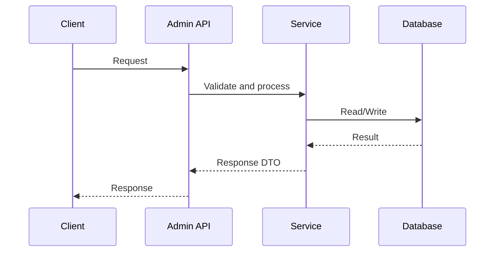
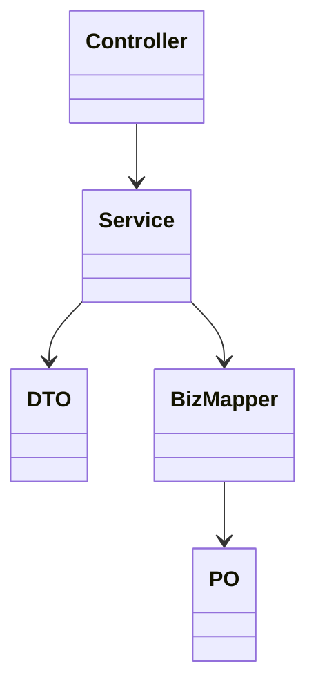

# S2 技术方案模板（不含实现细节）

## 1. 设计目标与范围

## 2. 数据库设计
### 2.1 表/字段
### 2.2 索引与约束
### 2.3 迁移与兼容策略

## 3. API 设计
### 3.1 接口清单
### 3.2 请求/响应模型
### 3.3 错误码
### 3.4 向后兼容策略

## 4. API 时序图

## 5. UML 图

## 6. 方案边界与不做项

## 7. 结论
- 是否进入 S3：待用户确认
